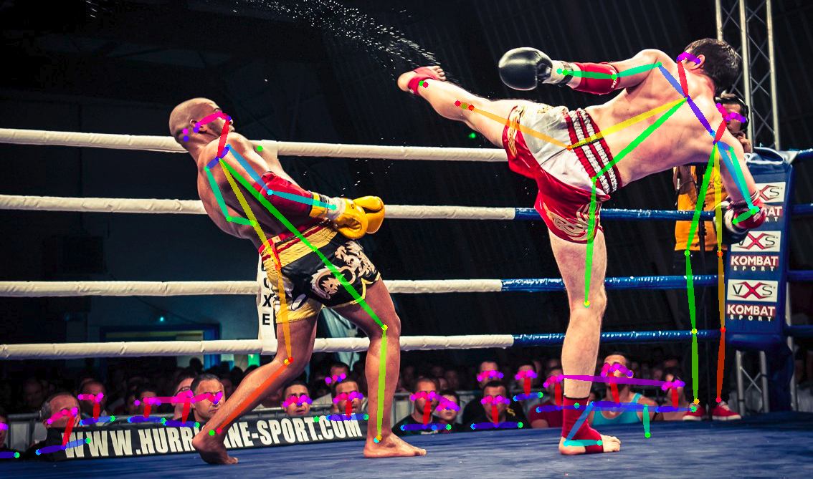

# นักมวยโคเดอร์ 

# Hi! I'm **nakmuaycoder**

I'm a former professional muay thai fighter passionated in Artificial intelligence. 
I’m currently working as **AI Engineer** at **NAVAL GROUP**.

Connect with me :

## Languages and Tools:

#### Platforms

 
 

  
#### Software Development

 

 

#### Data Science

 

## PROFESSIONAL EXPERIENCES
* __06.21 - 01.22__, R&D DATA SCIENTIST, _NAVAL GROUP_, TOULON, FRANCE
* __02.18 - 08.19__, DATA SCIENTIST, _AIRBUS HELICOPTERS_, MARSEILLE, FRANCE
* __10.17 - 02.18__, DATA ANALYST, _PwC France_, MONTPELLIER, FRANCE
* __01.16 - 05.17__, MUAY THAI FIGHTER, _Sitboonmee Gym_, BURIRAM, THAILAND
* __04.15 - 12.15__, DATA ANALYST _(internship)_, _GEMALTO_, LA CIOTAT, FRANCE
* __04.14 - 08.14__, Statistician _(internship)_, _Commission Locale d’Information de Cadarache et d’ITER_, AIX EN PROVENCE, FRANCE

## EDUCATION
* __2013 - 2015__, Master Maths et Application, _Aix Marseille Université_, France
* __2010 - 2013__, Bachelor Maths Appliqués, _Aix Marseille Université_, France
