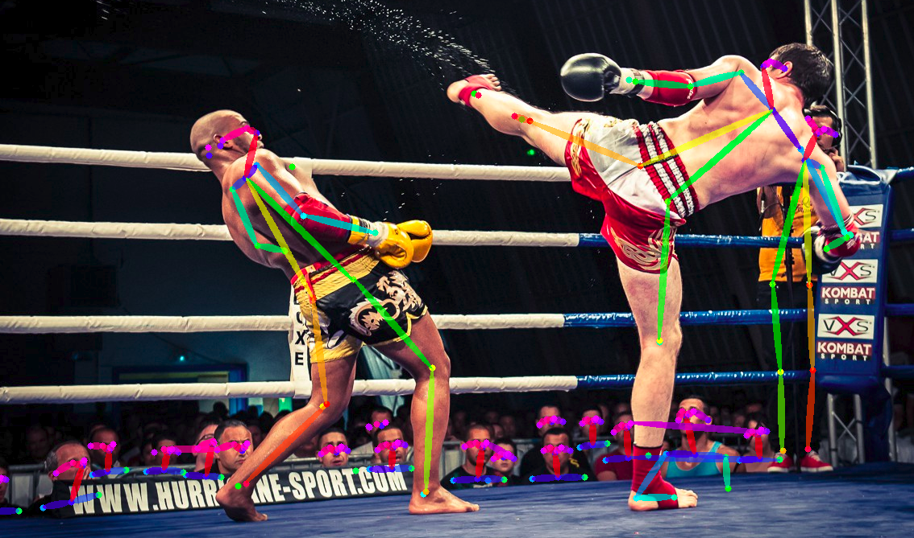

<!-- Banner -->

# 🥊 Hi, I'm **nakmuaycoder**

A former professional Muay Thai fighter turned AI enthusiast.  
Currently working as a **Data Scientist** at **Syroco**, blending physical discipline with analytical precision.

---

## 🔗 Connect with Me

  <a href="https://www.linkedin.com/in/olivier-feher-9446b5105/" target="_blank">
    
    &nbsp;LinkedIn
  </a>

---

## 🛠️ Languages & Tools

### 💻 Platforms

  
  
  
  
  

### 👨‍💻 Software Development

  
  
  
  
  

### 📊 Data Science & AI

  
  
  
  
  
  
  
  

### 📈 Data Visualization

  
  
  

---

## 💼 Professional Experience

| Year          | Position                                                      | Company                                                                                                                                                                         | Location                |
| ------------- | ------------------------------------------------------------- | ------------------------------------------------------------------------------------------------------------------------------------------------------------------------------- | ----------------------- |
| 04.2025–Now   | Data Scientist (R\&D)                                         |                                                                                                  | Marseille, France       |
| 08.2022–04.25 | ML Engineer                                                   |                       | Paris, France           |
| 01.2022–08.22 | AI Engineer                                                   |                                                   | Saint-Tropez, France    |
| 06.2021–01.22 | Data Scientist (R\&D)                                         |                                                    | Toulon, France          |
| 02.2018–08.19 | Data Scientist                                                |                         | Marseille, France       |
| 10.2017–02.18 | Data Analyst                                                  |                                    | Montpellier, France     |
| 01.2016–05.17 | 🥊 Muay Thai Fighter                                          |  **Sitboonmee Gym**   | Buriram, Thailand       |
|               | [Watch Me Fight](https://www.youtube.com/watch?v=Cl7UZN4Wqzk) |                                                                                                                                                                                 |                         |
| 04.2015–12.15 | Data Analyst (Internship)                                     |                                                          | La Ciotat, France       |
| 04.2014–08.14 | Statistician (Internship)                                     |   | Aix-en-Provence, France |

---

## 🎓 Education

- **Master** in Mathematics & Applications – *Aix-Marseille Université* (2013–2015)  
- **Bachelor** in Applied Mathematics – *Aix-Marseille Université* (2010–2013)

---

> _From the ring to the code — discipline, precision, and endurance are my tools in both._

